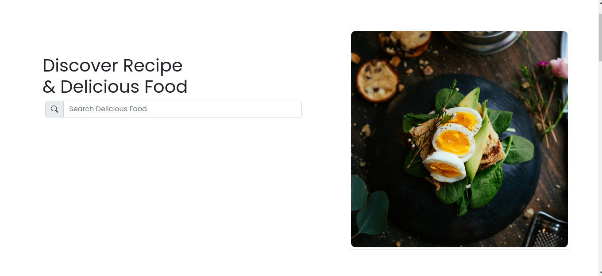
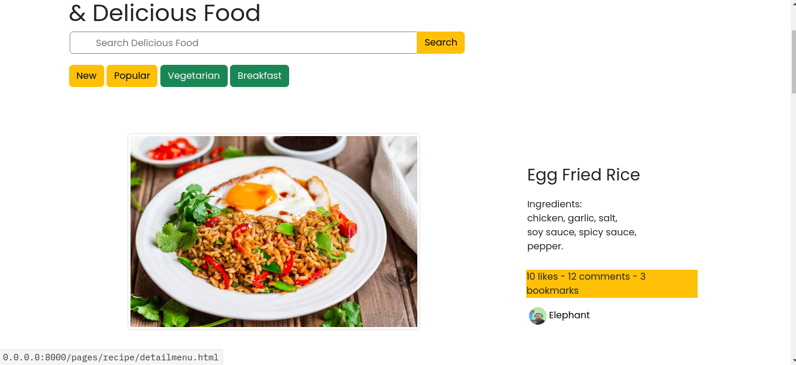
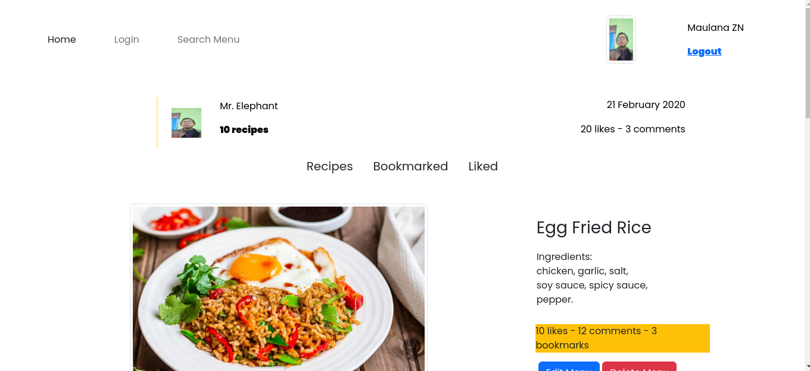

<div align="center">
    <h1>Mama Recipe Web Design</h1>
    <image src="https://github.com/maulanazn/RecipeMobileV1/blob/main/src/assets/pijarfoodbootsplash.png" width="230">
    <p>Mama Recipe Web Design, repository for plain web and no dynamic interaction with data</p>
</div>

---

<div align="center">
    This part built with some common technology, such as:
    <ul>
        <li><a href="https://developer.mozilla.org/en-US/docs/Learn/Getting_started_with_the_web/HTML_basics"></a></li>
        <li><a href="https://en.wikipedia.org/wiki/CSS"></a></li>
        <li><a href="https://developer.mozilla.org/en-US/docs/Web/javascript"></a></li>
        <li><a href="https://getbootstrap.com/"></a></li>
    </ul>
</div>

## Prerequisite:
- Computer
- Internet
- Mind

## Installation:
1. Clone the project 
```sh
    git clone https://github.com/maulanazn/recipebe
```
2. Run the index.html file
```sh
    double click on index.html file or open it with search bar in browser
```
## Contributing

Contributions are what make the open source community such an amazing place to be learn, inspire, and create. Any contributions you make are **greatly appreciated**.

1. Fork the Project
2. Create your Feature Branch (`git checkout -b <username>/<feature-details>`)
3. Commit your Changes (`git commit -m 'Add some AmazingFeature'`)
4. Push to the Branch (`git push origin yourbranch`)
5. Open a Pull Request

## ScreenShot

| image    |    page    |
|----------|------------|
|  | Login | 
|  | HomePage |
|  | All Recipe | 
|  | User Homepage Recipe | 

## Related Project
* [`Mama Recipes Demo`](https://mamarecipeweb.pages.dev/)
* [`Mama Recipes Rest API`](https://stormy-bass-cloak.cyclic.cloud/)
* [`Mama Recipes Frontend Repository`](https://github.com/maulanazn/mamarecipeweb)